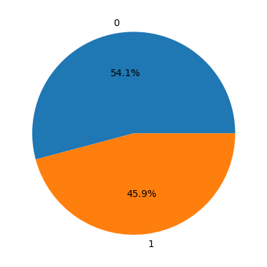
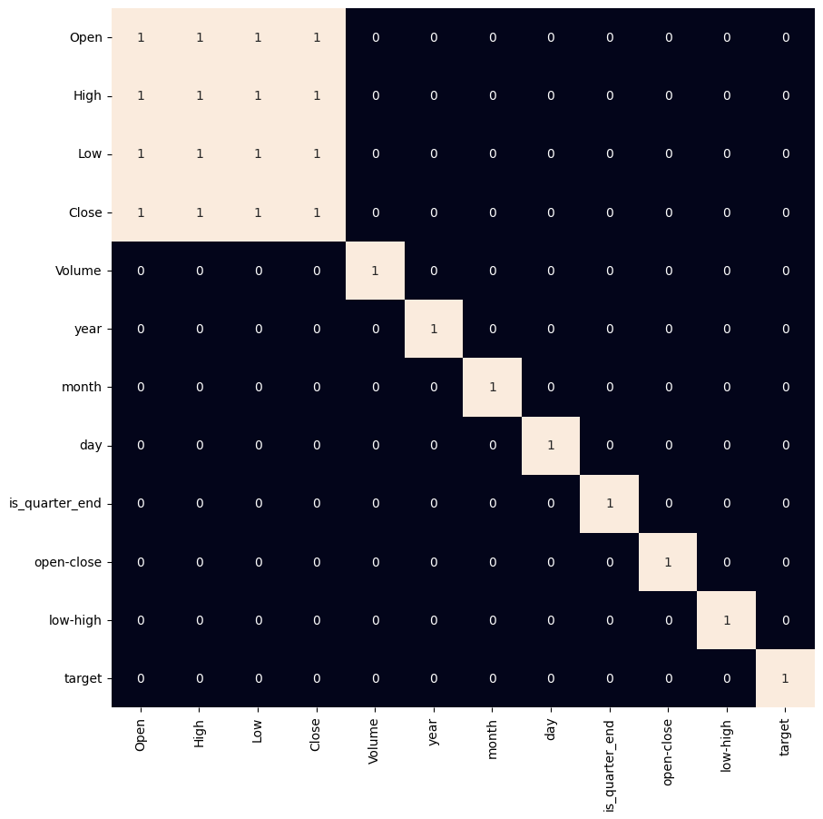

# Bitcoin Price Direction Classification — Model Comparison

Predicts whether Bitcoin's closing price will go **up or down the next day**, using engineered price features and comparing three classifiers: Logistic Regression, SVM (polynomial kernel), and XGBoost.

## What it does

1. Loads the Bitcoin price CSV and prints exploratory info (head, shape, describe, info).
2. Plots the full closing-price history.
3. Confirms `Close` and `Adj Close` are identical, then drops the redundant `Adj Close` column.
4. Plots the distribution and boxplot of each price column (`Open`, `High`, `Low`, `Close`).
5. Splits the `Date` string into `year`/`month`/`day` columns, then parses `Date` as an actual datetime.
6. Plots mean Open/High/Low/Close per year.
7. Engineers modeling features: `is_quarter_end` (is the month a quarter-end?), `open-close`, `low-high`, and the binary **target**: whether tomorrow's close is higher than today's.
8. Plots the target class balance (pie chart) and a correlation heatmap of strongly correlated feature pairs.
9. Scales the final features and splits into train/validation sets.
10. Trains Logistic Regression, SVM, and XGBoost, printing ROC-AUC on both training and validation sets for each.
11. Plots a confusion matrix for the Logistic Regression model on the validation set.

## Concepts covered

- **Binary direction prediction (not price regression)** — instead of predicting the exact future price (a much harder regression problem), the target is simplified to a binary up/down classification, which is both easier to model and more directly useful for a trading-style decision.
- **Feature engineering from OHLC data** — `open-close` and `low-high` are simple derived spreads that often carry more predictive signal about momentum/volatility than the raw price levels themselves.
- **Calendar-based features** — `is_quarter_end` captures a recurring calendar effect (quarter-end trading behavior) that a model can't infer from price alone without it being made explicit as a feature.
- **`shift(-1)` for next-day targets** — `df['Close'].shift(-1) > df['Close']` compares each row's close price to the *next* row's, which is the standard pandas idiom for building a "did it go up tomorrow" label from a single price column.
- **ROC-AUC vs. plain accuracy** — ROC-AUC measures how well the model ranks positive vs. negative cases across all classification thresholds, which is more informative than accuracy alone, especially if the up/down classes aren't perfectly balanced.
- **Comparing multiple classifiers on identical features** — training Logistic Regression, SVM, and XGBoost on the exact same scaled feature set isolates the effect of model choice, making the ROC-AUC comparison meaningful.

## Project structure

```
main.py      # full pipeline, organized into functions (config, data loading,
              # exploration, date/target feature engineering, scaling,
              # training/comparison, confusion matrix)
README.md    # this file
```

The code is organized into small, named functions driven by a `PipelineConfig` dataclass — `load_data`, `drop_redundant_column`, `engineer_date_features`, `engineer_target_features`, `prepare_features`, `train_and_compare_models`, `plot_confusion_matrix` — tied together by `run_pipeline()`.

## Requirements

```
numpy
pandas
matplotlib
seaborn
scikit-learn
xgboost
```

Install with:

```bash
pip install numpy pandas matplotlib seaborn scikit-learn xgboost
```

## How to run

Place the dataset (e.g. `bitcoin.csv`, with `Date`, `Open`, `High`, `Low`, `Close`, `Adj Close` columns) in the same directory as `main.py`, then:

```bash
python main.py
```

## Sample output

Running the script prints exploratory stats and ROC-AUC scores for each model, and displays several plots along the way (price history, feature distributions, yearly averages, target balance, correlation heatmap, confusion matrix).

**Target class balance**



**Confusion matrix**



## References

- [GeeksforGeeks — Machine Learning Projects](https://www.geeksforgeeks.org/machine-learning/machine-learning-projects/) — used as a general reference/inspiration while working on this project.

---
*This is a personal learning project, not financial advice or a trading system.*
