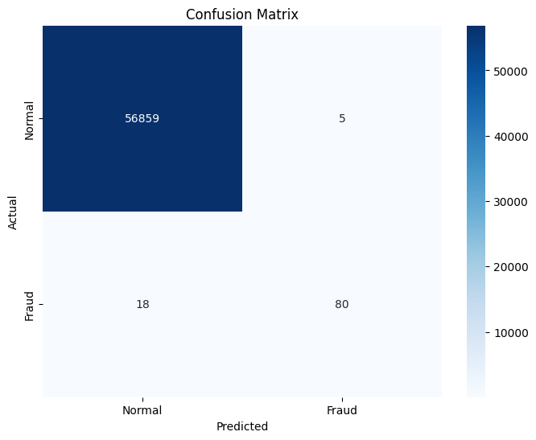

# Credit Card Fraud Detection with Random Forest

Detects fraudulent credit card transactions using a Random Forest classifier on the classic (highly imbalanced) credit card fraud dataset.

## What it does

1. Loads the transactions CSV and prints basic exploratory info (head, summary statistics).
2. Explores class balance: counts fraud vs. valid transactions, computes the fraud-to-valid ratio, and compares transaction amount statistics between the two classes.
3. Splits the data into features (`X`) and target (`y`, the `Class` column), then into train/test sets — stratified so the fraud/valid ratio is preserved in both splits, since fraud is a small minority class.
4. Trains a `RandomForestClassifier`, filtering out any rows with missing labels first.
5. Evaluates on the test set with accuracy, precision, recall, F1, and Matthews correlation coefficient (MCC).
6. Plots a confusion matrix of predicted vs. actual class.

## Concepts covered

- **Class imbalance** — fraud is a tiny fraction of all transactions, so accuracy alone is a poor metric (a model that always predicts "not fraud" would still score very high accuracy). Precision, recall, F1, and MCC give a much more honest picture of how well the model actually catches fraud without over-flagging valid transactions.
- **Stratified train/test split** — `train_test_split(..., stratify=y)` ensures the rare fraud class is proportionally represented in both the training and test sets, rather than risking a split where fraud cases are unevenly distributed.
- **Matthews correlation coefficient (MCC)** — a single balanced metric (ranging -1 to 1) that accounts for all four confusion matrix categories (true/false positives/negatives), and is particularly well-suited to imbalanced classification problems compared to accuracy or even F1 alone.
- **Random Forest for tabular data** — an ensemble of decision trees that tends to perform well out-of-the-box on structured/tabular data like this, without heavy feature engineering or scaling.
- **Confusion matrix** — shows exactly how many fraud cases were missed (false negatives) vs. how many valid transactions were incorrectly flagged (false positives), which matters a lot in fraud detection since those two error types have very different real-world costs.

## Project structure

```
main.py      # full pipeline, organized into functions (config, data loading,
              # exploration, feature/target split, training, evaluation, visualization)
README.md    # this file
```

The code is organized into small, named functions driven by a `PipelineConfig` dataclass — `load_data`, `explore_class_balance`, `prepare_features`, `split_data`, `train_model`, `evaluate_model`, `plot_confusion_matrix` — tied together by `run_pipeline()`.

## Requirements

```
numpy
pandas
matplotlib
seaborn
scikit-learn
```

Install with:

```bash
pip install numpy pandas matplotlib seaborn scikit-learn
```

## How to run

Place the dataset (e.g. `creditcard.csv`, with a `Class` column: `0` = valid, `1` = fraud) in the same directory as `main.py`, then:

```bash
python main.py
```

## Sample output

Running the script prints class balance stats, evaluation metrics, and displays a confusion matrix.

**Confusion matrix**



## References

- [GeeksforGeeks — Machine Learning Projects](https://www.geeksforgeeks.org/machine-learning/machine-learning-projects/) — used as a general reference/inspiration while working on this project.


---
*This is a personal learning project, not a production fraud detection system.*
