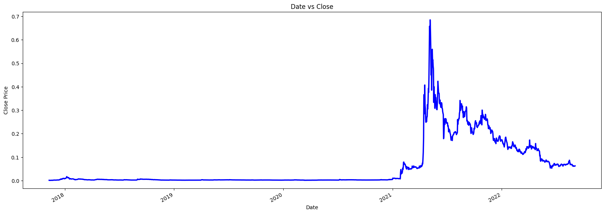
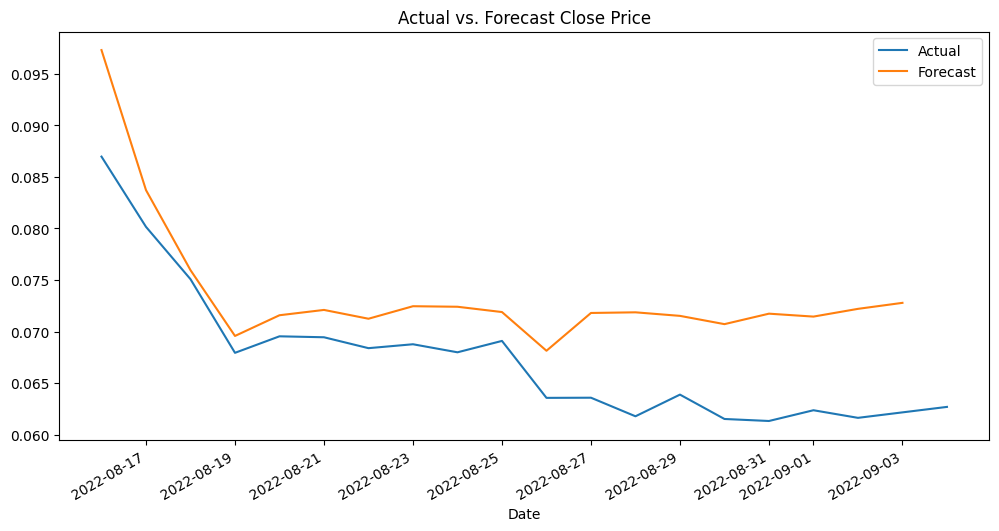

# DOGE-USD Price Forecasting with SARIMAX

Forecasts Dogecoin (DOGE-USD) closing price using a SARIMAX time series model, with engineered price/volume features used as exogenous regressors alongside the time series itself.

## What it does

1. Loads the DOGE-USD price CSV and prints correlation and missing-value diagnostics.
2. Parses the `Date` column and sets it as the index, then drops rows with missing values.
3. Plots mean closing price over time.
4. Engineers several price/volume features (`gap`, `a`, `b`, etc.) from `High`, `Low`, and `Volume`, and checks their correlation with `Close`.
5. Selects a final feature subset and splits the most recent 30 rows into a small train set (first 11 rows) and test set (remaining 19 rows), in chronological order.
6. Fits a `SARIMAX` model on the training set, using `Close` as the target and the other engineered features as exogenous (external) regressors.
7. Forecasts `Close` over the test period and plots actual vs. predicted values.

## Concepts covered

- **SARIMAX with exogenous regressors** — unlike plain ARIMA, SARIMAX can incorporate external variables (`exog`) alongside the autoregressive/moving-average structure of the time series itself, letting engineered features like price range or high/low ratios inform the forecast, not just past `Close` values.
- **Chronological train/test splitting** — for time series, splitting must preserve time order (train on earlier data, test on later data); a random shuffle-based split would leak future information into training and make the forecast look artificially good.
- **Feature engineering from OHLCV data** — deriving ratios and spreads (like `High - Low`, `High / Volume`) from raw Open-High-Low-Close-Volume data is a common way to give a model more informative signals than the raw columns alone.
- **Correlation-based feature screening** — checking `abs(corr()["Close"])` before finalizing which features to keep is a quick way to spot which engineered features actually relate to the target, before committing to them in the model.

## Project structure

```
main.py      # full pipeline, organized into functions (config, data loading,
              # cleaning, exploration, feature engineering, splitting,
              # model fitting, forecasting, visualization)
README.md    # this file
```

The code is organized into small, named functions driven by a `PipelineConfig` dataclass — `load_data`, `clean_data`, `engineer_features`, `split_train_test`, `fit_sarimax`, `forecast`, `plot_forecast` — tied together by `run_pipeline()`.

## Requirements

```
pandas
matplotlib
statsmodels
```

Install with:

```bash
pip install pandas matplotlib statsmodels
```

## How to run

Place the price CSV (e.g. `DOGE-USD.csv`, with `Date`, `High`, `Low`, `Close`, `Volume` columns) in the same directory as `main.py`, then:

```bash
python main.py
```

## Sample output

Running the script prints correlation tables, model summary statistics, and displays the closing-price trend plot plus the actual-vs-forecast comparison plot.

**Close price over time**



**Actual vs. forecast**




---
*This is a personal learning project, not financial advice or a trading system.*
