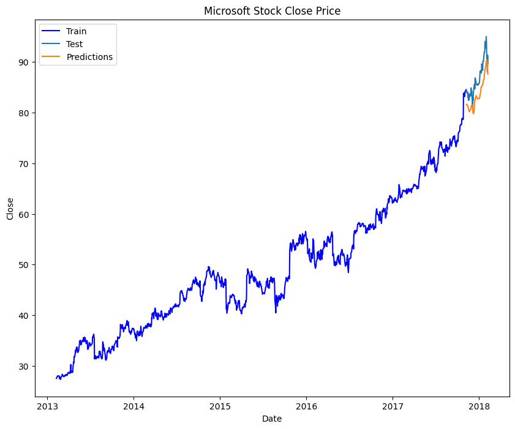

# Microsoft Close Price Forecasting (LSTM)

Explores Microsoft's historical stock data, then builds and trains an LSTM neural network to forecast its closing price from its own price history.

## What it does

1. Loads the Microsoft stock CSV and parses dates.
2. Plots open vs. close price, and trading volume, over time.
3. Plots a correlation heatmap of the numeric columns.
4. Previews how many rows fall in a configured date range, and plots the full closing-price history.
5. Scales the closing price with `StandardScaler`, and builds sliding-window sequences: each input is the previous 60 days' prices, predicting the next day's price.
6. Splits into training and test sequence windows (95% train by default).
7. Builds a two-layer LSTM regressor, compiles it with Adam optimizer, MAE loss, and RMSE as a tracked metric, and trains it.
8. Predicts on the test sequences and **inverts the scaling** back to real dollar values.
9. Plots actual training prices, actual test prices, and predicted prices together for visual comparison.

## Concepts covered

- **Sliding-window sequence construction** — an LSTM needs sequences, not single rows; each training example is built from the *previous* 60 days of scaled prices to predict the *next* day's price, the standard way to frame a time series as a supervised learning problem.
- **Never overwrite your scaler object** — `StandardScaler().fit_transform(dataset)` returns the *transformed data*, not the scaler; keeping the fitted scaler object itself (separate from its output array) is essential, since it's needed afterward to invert predictions from scaled space back into real, interpretable price values.
- **Always inverse-transform before comparing to real values** — a model trained on standardized data (mean 0, unit variance) produces predictions in that same standardized space; plotting or comparing those predictions directly against real dollar prices without inverting the scaling first produces numbers that look nothing like the actual data, even if the model is working correctly.
- **Consistent windowing between train and test** — the test sequences are built starting `window_size` rows *before* the train/test split point, so the first test prediction still has a full 60-day window of real historical context.
- **MAE loss with RMSE tracked as a metric** — the model optimizes for Mean Absolute Error (less sensitive to occasional large price swings) while also reporting Root Mean Squared Error during training, giving two different views of forecast error.

## Project structure

```
main.py      # full pipeline, organized into functions (config, data loading,
              # visualization, sequence windowing, LSTM model, training,
              # forecasting, visualization)
README.md    # this file
```

The code is organized into small, named functions driven by a `PipelineConfig` dataclass — `load_data`, `prepare_train_test`, `build_sequences`, `build_model`, `train_model`, `forecast`, `plot_forecast` — tied together by `run_pipeline()`.

## Requirements

```
numpy
pandas
matplotlib
seaborn
tensorflow
scikit-learn
```

Install with:

```bash
pip install numpy pandas matplotlib seaborn tensorflow scikit-learn
```

## How to run

Place the dataset (e.g. `MicrosoftStock.csv`, with `date`, `open`, `close`, `volume` columns) in the same directory as `main.py`, then:

```bash
python main.py
```

## Sample output

Running the script displays open/close and volume plots, a correlation heatmap, the model's summary, training progress per epoch, and a final train/actual/predicted comparison plot in real dollar values.

**Actual vs. predicted close price**




---
*This is a personal learning project, not financial advice or a trading system.*
