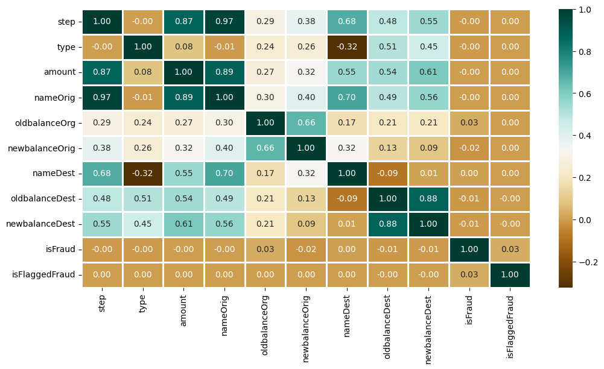
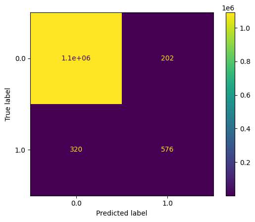

# Online Payment Fraud Detection — Model Comparison

Detects fraudulent mobile-money transactions using a combination of transaction-type encoding and three classifiers: Logistic Regression, XGBoost, and Random Forest.

## What it does

1. Loads the transaction dataset and prints exploratory info (head, info, describe).
2. Summarizes column types: how many categorical, integer, and float columns exist.
3. Plots transaction type counts and prints fraud vs. non-fraud counts.
4. Plots the distribution of the `step` column (a time-index field in this dataset).
5. Plots a correlation heatmap — factorizing every column first (turning categorical values into numeric codes) so even non-numeric columns can be included in the correlation matrix.
6. One-hot encodes the `type` column, drops identifier columns (`nameOrig`, `nameDest`) and the original `type` column, and cleans up boolean dtypes into integers.
7. Splits into train/test sets.
8. Trains Logistic Regression, XGBoost, and Random Forest, printing ROC-AUC on both training and test sets for each.
9. Plots a confusion matrix for the XGBoost model on the test set.

## Concepts covered

- **Factorize-then-correlate for mixed-type data** — `data.apply(lambda x: pd.factorize(x)[0]).corr()` converts every column (including categorical/text ones) into numeric codes before computing correlations, which is a quick way to include non-numeric columns in a correlation heatmap that `df.corr()` alone would otherwise skip.
- **One-hot encoding transaction type** — `pd.get_dummies(..., drop_first=True)` converts the categorical `type` column (e.g. "CASH_OUT", "TRANSFER") into binary indicator columns, dropping one category to avoid redundant (perfectly correlated) columns — a common trap called the "dummy variable trap."
- **Dropping identifiers before modeling** — `nameOrig`/`nameDest` are unique-per-transaction identifiers that carry no generalizable signal; keeping them in the feature set would let models "memorize" specific accounts rather than learn fraud patterns.
- **ROC-AUC for imbalanced fraud detection** — fraud is typically a small minority class, so ROC-AUC (which measures ranking quality across all thresholds) gives a much more honest read on model performance than raw accuracy would.
- **Comparing multiple classifiers on identical features** — training Logistic Regression, XGBoost, and Random Forest on the same prepared feature set isolates the effect of model choice, making the ROC-AUC comparison meaningful.

## Project structure

```
main.py      # full pipeline, organized into functions (config, data loading,
              # exploration, encoding, splitting, training/comparison,
              # confusion matrix)
README.md    # this file
```

The code is organized into small, named functions driven by a `PipelineConfig` dataclass — `load_data`, `summarize_column_types`, `encode_and_prepare`, `split_data`, `train_and_compare_models`, `plot_confusion_matrix` — tied together by `run_pipeline()`.

## Requirements

```
numpy
pandas
matplotlib
seaborn
scikit-learn
xgboost
```

Install with:

```bash
pip install numpy pandas matplotlib seaborn scikit-learn xgboost
```

## How to run

Place the dataset (e.g. `new_data.csv`, with `type`, `nameOrig`, `nameDest`, `isFraud`, and other transaction columns) in the same directory as `main.py`, then:

```bash
python main.py
```

## Sample output

Running the script prints column-type summaries, fraud counts, and ROC-AUC scores for each model, and displays plots for transaction type counts, the `step` distribution, the correlation heatmap, and the confusion matrix.

**Correlation heatmap**



**Confusion matrix**



## References

- [GeeksforGeeks — Machine Learning Projects](https://www.geeksforgeeks.org/machine-learning/machine-learning-projects/) — used as a general reference/inspiration while working on this project.
---
*This is a personal learning project, not a production fraud detection system.*
