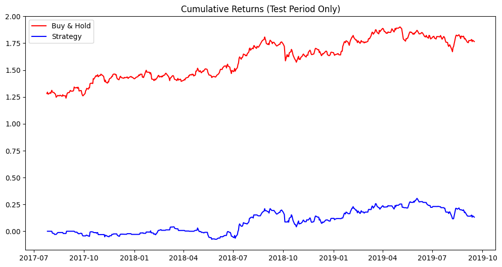

# Stock Direction Prediction + Trading Strategy Backtest (SVM)

Predicts whether a stock's closing price will go **up or down the next day** using an SVM classifier on simple price-spread features, compares several SVM kernels, and backtests a basic trading strategy built from the model's predictions.

## What it does

1. Loads the price CSV and sets `Date` as the index.
2. Engineers two simple features — `Open-Close` and `High-Low` — and the binary target: whether tomorrow's close is higher than today's.
3. Splits the data **chronologically** (no shuffling) into an 80% training period and a 20% test period.
4. Trains a baseline SVM (default RBF kernel) and reports training accuracy, test accuracy, ROC-AUC, and F1 score.
5. Backtests a simple long/flat trading strategy: the model's predicted signal (1 = predicted up, 0 = predicted flat/down) is multiplied by the next day's actual return, **using predictions from the test period only**, and plots cumulative buy-and-hold returns vs. the strategy's cumulative returns.
6. Trains SVMs with four different kernels (RBF, linear, polynomial, sigmoid) and compares their test accuracy.

## Concepts covered

- **Chronological train/test splitting for time series** — splitting by position (`X[:split]`, `X[split:]`) rather than a random shuffle keeps the test period strictly *after* the training period in time, which matters because a random split would let the model train on data from after the point it's being "tested" on — an unrealistic advantage no real trading system would have.
- **Avoiding look-ahead in a backtest** — a trading strategy should only use signals from a model that genuinely hasn't seen the outcome yet. Generating predictions for the *entire* dataset (including the training period) and then computing a backtest over all of it mixes in-sample performance (the model grading data it already learned from) with genuine out-of-sample performance, which makes a strategy look better than it would actually perform live. Restricting the backtest to test-period predictions only avoids this.
- **Simple price-spread features** — `Open-Close` and `High-Low` are lightweight derived features that capture some of a day's volatility/momentum without needing more complex technical indicators.
- **Comparing SVM kernels** — the kernel determines what kind of decision boundary the SVM can draw (linear, polynomial, or the more flexible RBF/sigmoid); comparing them on the same data shows whether a more complex kernel actually improves accuracy for this particular feature set, or just adds complexity without benefit.
- **ROC-AUC and F1 alongside accuracy** — for a roughly-balanced up/down target, these give a fuller picture of ranking quality (ROC-AUC) and the precision/recall tradeoff (F1) than accuracy alone.

## Project structure

```
main.py      # full pipeline, organized into functions (config, data loading,
              # feature/target engineering, splitting, SVM training,
              # evaluation, strategy backtest, kernel comparison)
README.md    # this file
```

The code is organized into small, named functions driven by a `PipelineConfig` dataclass — `load_data`, `engineer_features_and_target`, `split_data`, `train_default_svm`, `backtest_strategy`, `evaluate_model`, `compare_kernels` — tied together by `run_pipeline()`.

## Requirements

```
numpy
pandas
matplotlib
scikit-learn
```

Install with:

```bash
pip install numpy pandas matplotlib scikit-learn
```

## How to run

Place the price CSV (e.g. `RELIANCE.csv`, with `Date`, `Open`, `High`, `Low`, `Close` columns) in the same directory as `main.py`, then:

```bash
python main.py
```

## Sample output

Running the script prints model accuracy/ROC-AUC/F1, displays a cumulative-returns comparison chart for the test period, and prints accuracy for each SVM kernel tested.

**Cumulative returns: buy & hold vs. strategy**




## A note on the results

In testing, this particular feature set (`Open-Close`, `High-Low`) produced accuracy close to 50% across every kernel tried — essentially coin-flip performance for next-day direction. That's a realistic and common outcome for simple price-spread features on daily stock direction prediction: it doesn't mean the code is broken, it means these two features alone don't carry much predictive signal for this target. The kernel comparison and backtest structure here are reusable for richer feature sets (technical indicators, volume-based features, multi-day lags) that might do better.

## References

- [GeeksforGeeks — Machine Learning Projects](https://www.geeksforgeeks.org/machine-learning/machine-learning-projects/) — used as a general reference/inspiration while working on this project.

---
*This is a personal learning project, not financial advice or a trading system. Past backtest performance, even done correctly, does not predict future results.*
