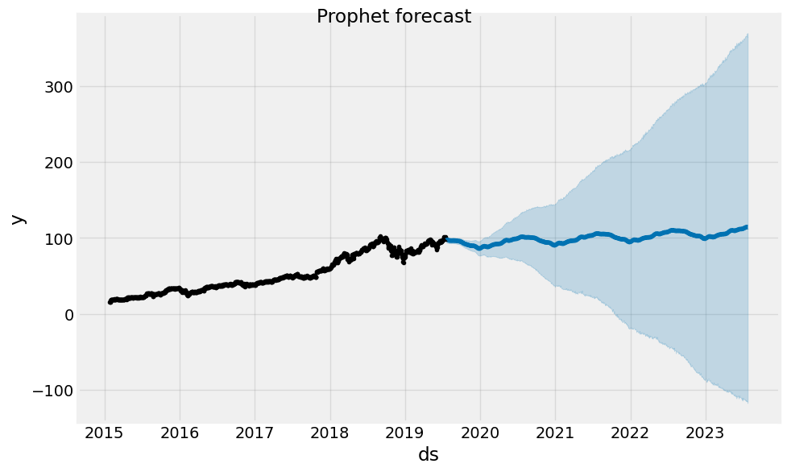
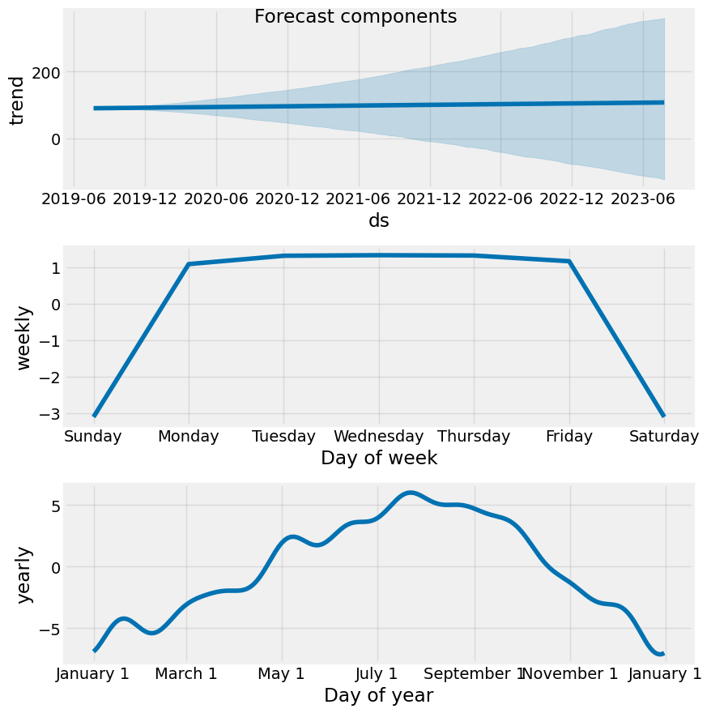

# Share Price Forecasting with Facebook Prophet

Forecasts a stock's **adjusted closing price** over a multi-year held-out period using [Prophet](https://facebook.github.io/prophet/), Meta's additive time-series model, then visualizes the forecast and its trend/seasonality components and measures how far the predictions drift from actual prices.

## What it does

1. Loads historical daily price data for Amazon (`AMZN.csv`, downloaded from Yahoo Finance).
2. Reshapes the data into Prophet's required two-column format — `ds` (date) and `y` (the value to forecast, here `Adj Close`).
3. Splits the data **chronologically** at a cutoff date (`2019-07-21` by default): everything up to the cutoff is training data, everything after is the test period.
4. Fits a default Prophet model on the training period.
5. Forecasts prices for every trading date in the test period, along with an uncertainty interval (`yhat_lower` / `yhat_upper`).
6. Plots the full forecast, the decomposed components (trend, weekly and yearly seasonality), and actual vs. forecast prices over the test period.
7. Reports **MSE**, **MAE** and **MAPE** between the forecast and the real prices.

## Concepts covered

- **Prophet's additive model** — Prophet models a series as `trend + seasonality + holidays + noise`. The trend is a piecewise-linear curve with automatically detected changepoints, and seasonality is modeled with Fourier terms. That makes it easy to inspect *why* the model predicts what it does via the component plots.
- **The `ds` / `y` input format** — Prophet doesn't take arbitrary column names; the date column must be called `ds` and the target `y`. Preparing this frame is the main preprocessing step.
- **Chronological train/test splitting** — the test period lies strictly after the training period, so the model is evaluated the way it would be used: forecasting a future it hasn't seen. A random split would leak future information into training.
- **Automatic seasonality selection** — with daily data, Prophet enables weekly and yearly seasonality and disables daily seasonality on its own (it logs `Disabling daily seasonality`), since there's only one observation per day.
- **Uncertainty intervals** — Prophet returns a lower/upper bound alongside each point forecast. The band widens the further the forecast extends from the training data, which is an honest signal of how quickly confidence decays.
- **Error metrics** — MSE penalizes large misses heavily, MAE gives the average miss in price units (dollars), and MAPE expresses the average miss as a percentage of the true price, which is easier to compare across stocks at different price levels.

## Project structure

```
main.py      # full pipeline, organized into functions (config, data loading,
              # Prophet formatting, date-based split, training, forecasting,
              # evaluation, plotting)
README.md    # this file
```

The code is organized into small, named functions driven by a `PipelineConfig` dataclass — `load_data`, `prepare_prophet_frame`, `split_by_date`, `train_prophet`, `forecast_test_period`, `evaluate_forecast`, `plot_forecast`, `plot_components`, `plot_actual_vs_forecast` — tied together by `run_pipeline()`.

Settings such as the CSV path, target column and split date live in `PipelineConfig`, so you can try a different stock or cutoff without touching the pipeline code:

```python
from main import PipelineConfig, run_pipeline

run_pipeline(PipelineConfig(csv_path="MSFT.csv", split_date="2021-01-01"))
```

## Requirements

```
numpy
pandas
matplotlib
scikit-learn
prophet
```

Install with:

```bash
pip install numpy pandas matplotlib scikit-learn prophet
```

## How to run

Place the price CSV (e.g. `AMZN.csv`, with `Date`, `Open`, `High`, `Low`, `Close`, `Adj Close`, `Volume` columns, as exported from Yahoo Finance) in the same directory as `main.py`, then:

```bash
python main.py
```

## Sample output

Running the script prints the train/test date ranges, the last few forecast rows, and the error metrics, then displays three charts.

**Forecast (training history + test-period forecast with uncertainty band)**



**Forecast components (trend, weekly and yearly seasonality)**


**Error metrics on the test period (Jul 2019 – Jul 2023)**

| Metric | Value |
|--------|-------|
| MSE    | 1928.58 |
| MAE    | 34.28 |
| MAPE   | 22.62 % |

## A note on the results

A MAPE of about 22% means the forecast was off by roughly a fifth of the actual price on an average day — reasonable for a model that has never seen any data after mid-2019, but far from precise. Two things drive this:

- **A four-year forecast horizon.** The test period runs from July 2019 to July 2023, so the model is extrapolating its 2015–2019 trend years into the future. It has no way to anticipate regime changes such as the sharp 2020–2021 rally or the 2022 drawdown.
- **Very wide uncertainty intervals.** By mid-2023 the interval spans roughly −$116 to +$347 around a trend value of about $109. The negative lower bound isn't a bug — Prophet's additive model doesn't know prices can't go below zero — it's a sign of how little confidence the model has that far out.

Prophet is better suited to short horizons and series with strong, stable seasonality (sales, web traffic) than to stock prices, which are dominated by trend shifts and noise. Shorter test windows, rolling retraining (Prophet's built-in `cross_validation`), or forecasting log prices would all be natural next steps.

## References

- [Prophet documentation](https://facebook.github.io/prophet/docs/quick_start.html)
- [GeeksforGeeks — Machine Learning Projects](https://www.geeksforgeeks.org/machine-learning/machine-learning-projects/) — used as a general reference/inspiration while working on this project.

---
*This is a personal learning project, not financial advice or a trading system. Past forecasting performance does not predict future results.*
