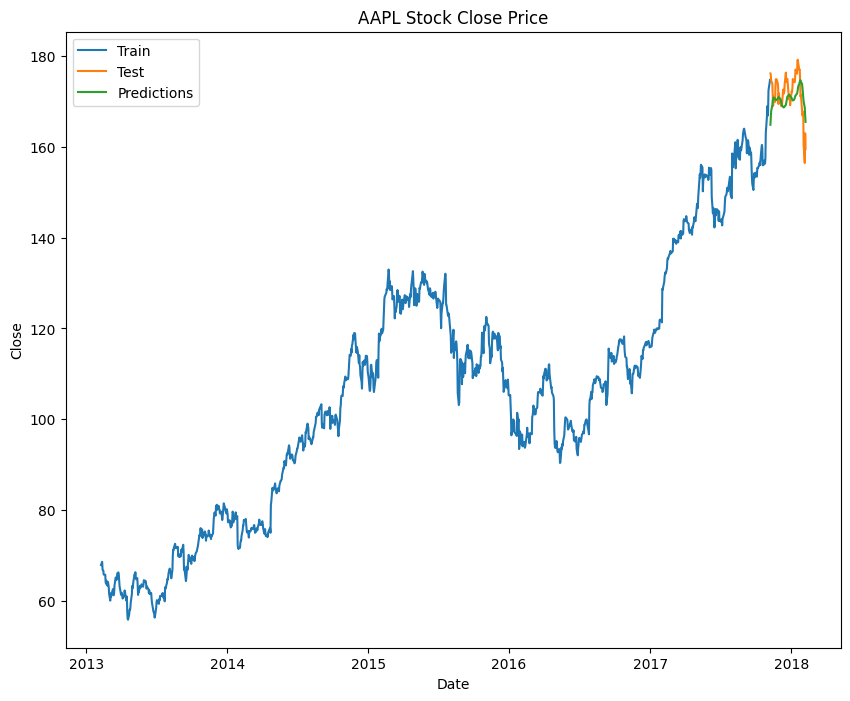

# Multi-Stock Exploration + Apple Close Price Forecasting (LSTM)

Explores 5 years of daily price data for several large-cap tech stocks, then builds and trains an LSTM neural network to forecast Apple's closing price from its own historical prices.

## What it does

1. Loads the multi-stock CSV (5 years of daily OHLCV data across many companies) and parses dates.
2. Plots open/close price and trading volume for a set of configured companies (AAPL, AMD, FB, GOOGL, AMZN, NVDA, EBAY, CSCO, IBM), one subplot per company.
3. Isolates Apple's rows, previews a configured date range, and plots its full closing-price history.
4. Scales Apple's closing price to `[0, 1]` with `MinMaxScaler`, and builds sliding-window sequences: each input is the previous 60 days' prices, predicting the next day's price.
5. Splits into training and test sequence windows (95% train by default).
6. Builds a two-layer LSTM regressor, compiles it with Adam optimizer and MSE loss, and **trains it** on the training sequences.
7. Predicts on the test sequences, inverts the scaling back to real dollar values, and reports MSE/RMSE.
8. Plots actual training prices, actual test prices, and predicted prices together for visual comparison.

## Concepts covered

- **Sliding-window sequence construction** — an LSTM needs sequences, not single rows; each training example is built from the *previous* 60 days of scaled prices (`train_data[i-60:i, 0]`) to predict the *next* day's price (`train_data[i, 0]`), which is the standard way to frame a time series as a supervised learning problem.
- **MinMax scaling for neural network inputs** — raw stock prices (tens to hundreds of dollars) are rescaled to `[0, 1]` before training, since neural networks generally train more effectively and stably on small, consistent-range inputs. The same scaler is later used to invert predictions back to real price values.
- **Train/compile/fit are all required** — building a Keras model (stacking layers) only defines its architecture; it must also be `.compile()`-d (choosing an optimizer and loss function) and `.fit()`-ed (actually trained on data) before its predictions mean anything. Skipping either step still lets `.predict()` run without error, but the output comes from untrained, randomly-initialized weights.
- **Consistent windowing between train and test** — the test sequences are built starting `window_size` rows *before* the train/test split point (`scaled_data[training_size - window_size:, :]`), so the first test prediction still has a full 60-day window of real historical context, rather than starting with an incomplete window.
- **RMSE for price forecasting** — Root Mean Squared Error is reported in the same units as the target (dollars here), making it more directly interpretable than raw MSE when judging forecast quality.

## Project structure

```
main.py      # full pipeline, organized into functions (config, data loading,
              # multi-company visualization, sequence windowing, LSTM model,
              # training, evaluation, forecast visualization)
README.md    # this file
```

The code is organized into small, named functions driven by a `PipelineConfig` dataclass — `load_data`, `get_target_company_data`, `build_sequences`, `prepare_train_test`, `build_model`, `train_model`, `evaluate_and_forecast`, `plot_forecast` — tied together by `run_pipeline()`.

## Requirements

```
numpy
pandas
matplotlib
tensorflow
scikit-learn
```

Install with:

```bash
pip install numpy pandas matplotlib tensorflow scikit-learn
```

## How to run

Place the dataset (e.g. `all_stocks_5yr.csv`, with `date`, `Name`, `open`, `close`, `volume` columns across multiple companies) in the same directory as `main.py`, then:

```bash
python main.py
```

To forecast a different company, change `PipelineConfig.target_company` (it must also be one of the `companies` visualized, or you can add it).

## Sample output

Running the script displays per-company price/volume plots, Apple's full price history, the trained model's summary, training progress per epoch, MSE/RMSE, and a final train/actual/predicted comparison plot.

**Actual vs. predicted close price**



## References

- [GeeksforGeeks — Machine Learning Projects](https://www.geeksforgeeks.org/machine-learning/machine-learning-projects/) — used as a general reference/inspiration while working on this project.
---
*This is a personal learning project, not financial advice or a trading system.*
