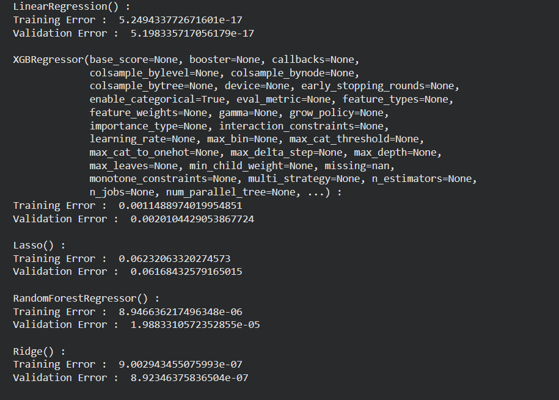
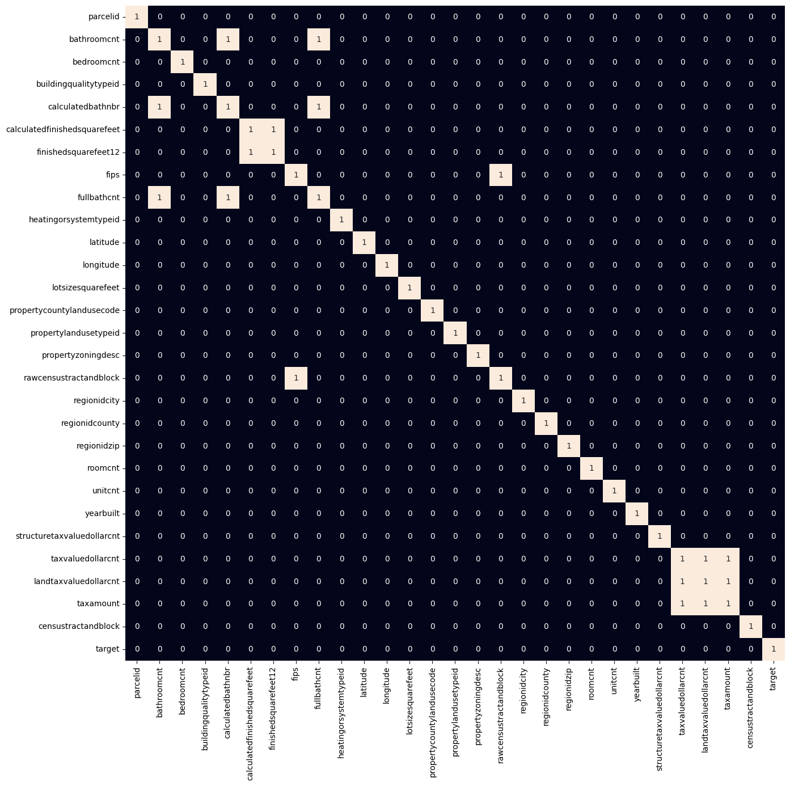

# Zillow Price Prediction — Model Comparison

Cleans and prepares the Zillow real-estate dataset, then trains and compares five regression models on predicting the `target` value (log-error).

## What it does

1. Loads the Zillow CSV.
2. Drops columns that are either constant (only one unique value) or mostly missing (more than 60% null).
3. Plots remaining missing-value counts per column.
4. Fills missing values: mode for categorical columns, mean for numeric ones.
5. Categorizes columns by dtype (int, float, object) and prints unique-value summaries for categoricals.
6. Plots the target variable's distribution and spread (histogram + boxplot).
7. Removes target outliers outside a configured range.
8. Label-encodes categorical columns.
9. Plots a correlation heatmap highlighting strongly correlated feature pairs (|corr| > 0.8).
10. Splits into train/validation sets and standardizes features (fit on train only).
11. Trains five regressors — Linear Regression, XGBoost, Lasso, Random Forest, Ridge — and prints training/validation MAE for each.

## Concepts covered

- **Missing-value strategy by dtype** — categorical columns get filled with the mode (most frequent value), numeric columns with the mean; a single blanket fill strategy usually isn't appropriate across mixed-type columns.
- **Constant/high-null column pruning** — columns with only one unique value carry no predictive signal, and columns that are mostly missing are usually not worth imputing; dropping both before deeper processing keeps the pipeline focused on informative features.
- **Outlier trimming on the target** — restricting the target to a plausible range before training prevents a small number of extreme values from disproportionately influencing model fit and error metrics.
- **Label encoding** — converts categorical string columns into integers so models that expect numeric input (most regressors here) can use them; unlike one-hot encoding, this assumes no ordinal relationship is being introduced, which is a simplification worth knowing about.
- **Correlation heatmap for multicollinearity** — flagging feature pairs with |correlation| > 0.8 helps spot redundant features that could destabilize some models (especially linear ones) before training.
- **Fit-on-train-only scaling** — `StandardScaler` is fit on the training set and only applied (not re-fit) to validation data, avoiding validation statistics leaking into the scaling.
- **Comparing multiple regressors on identical features** — training five different models on the same prepared data isolates the effect of model choice from the effect of preprocessing, making the MAE comparison meaningful.

## Project structure

```
main.py      # full pipeline, organized into functions (config, data loading,
              # cleaning, exploration, feature engineering, splitting,
              # training/comparison across five models)
README.md    # this file
```

The code is organized into small, named functions driven by a `PipelineConfig` dataclass — `load_data`, `drop_useless_columns`, `fill_missing`, `remove_outliers`, `encode_categoricals`, `split_and_scale`, `train_and_compare_models` — tied together by `run_pipeline()`.

## Requirements

```
numpy
pandas
matplotlib
seaborn
scikit-learn
xgboost
```

Install with:

```bash
pip install numpy pandas matplotlib seaborn scikit-learn xgboost
```

## How to run

Place the dataset (e.g. `Zillow.csv`, with a `parcelid` column and a `target` column) in the same directory as `main.py`, then:

```bash
python main.py
```

## Sample output

Running the script prints column-drop counts, missing-value diagnostics, correlation tables, and training/validation MAE for each of the five models; it also displays several plots along the way.

**Target distribution**



**Correlation heatmap**




---
*This is a personal learning project, not a production valuation model.*
